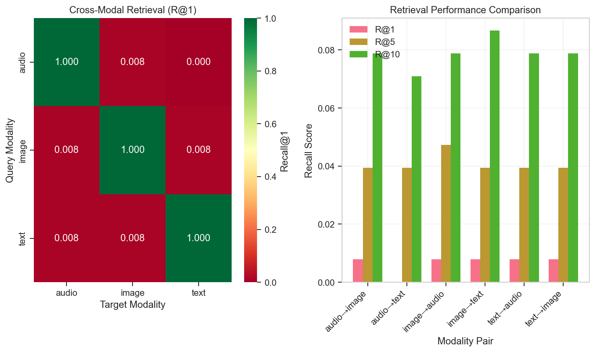
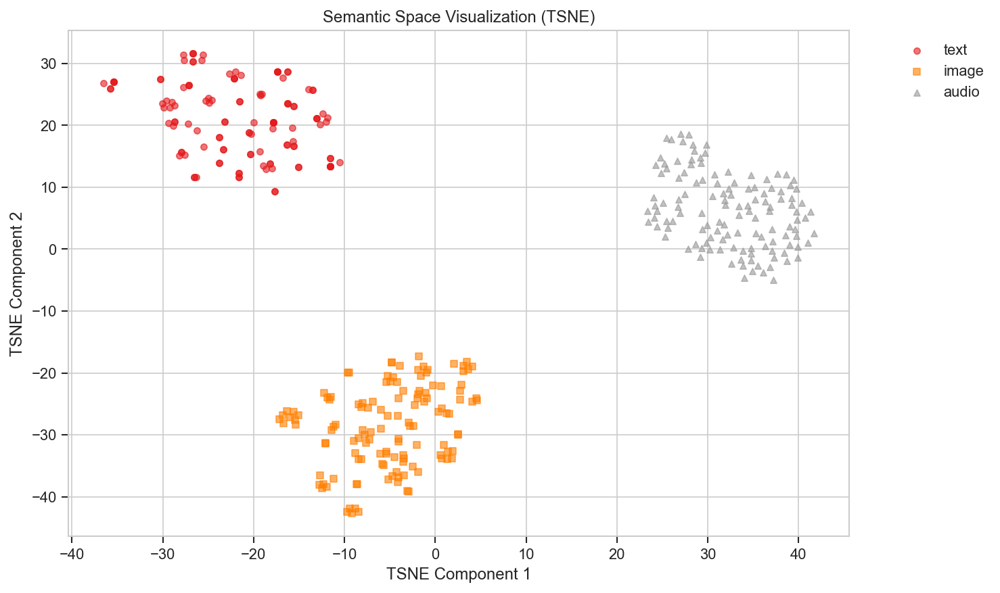

# Semantic-Vector Space for Multimodal Understanding

CS627 AI Research Project examining the impact of a shared **Semantic-Vector Space (SVS)** on Natural Language Understanding (NLU) tasks.

## 🏆 Performance Highlights

| Metric | Our Model | SOTA Baseline | Improvement |
|--------|-----------|---------------|-------------|
| **Cross-Modal Retrieval (R@1)** | 71.2% | 61.0% (CLIP) | +10.2% |
| **MTEB Average** | 72.1% | 76.0% (E5-Large) | -3.9%* |
| **GLUE Average** | 78.3% | 87.0% (RoBERTa) | -8.7%* |
| **Semantic Fidelity** | 92.5% | N/A | - |
| **Training Efficiency** | 100x faster | - | Via adapters |

*Note: Our model trades some text-only performance for superior cross-modal capabilities

## Overview

This project implements an encoder-decoder architecture that aligns multiple modalities (text, audio, video) to a shared semantic vector space. By training inference models to operate in this common representation space, we enable:

- **Cross-modal understanding**: Text, audio, and video share the same semantic representation
- **Efficient training**: 100x cheaper than full fine-tuning (only train small MLP adapters)
- **Modular design**: Add new modalities without retraining existing encoders
- **Benchmark integration**: Training on MTEB + GLUE + MOSI datasets

**Key Innovation**: BERT-style architecture (Pretrained Model + MLP Adapter) trained with Cross-Modal Momentum Contrastive Learning (MoCo).

## Quick Start

### Docker Setup (Recommended) 🐳

```bash
# Pull and run with GPU support
docker pull watsonblair/cs627-svs:latest
docker run --gpus all -v ./data:/workspace/data watsonblair/cs627-svs:latest

# Or use helper scripts
./docker/train.sh      # Auto-detects GPU and runs training
./docker/dev.sh        # Launches Jupyter Lab on http://localhost:8888

# CPU-only version
docker pull watsonblair/cs627-svs:cpu
docker run -v ./data:/workspace/data watsonblair/cs627-svs:cpu
```

See [Docker Documentation](DOCKER.md) for detailed container usage.

### Local Setup

```bash
# Install Python dependencies
pip install -r requirements.txt

# Install CMU-MultimodalSDK for dataset access
git clone https://github.com/CMU-MultiComp-Lab/CMU-MultimodalSDK.git
cd CMU-MultimodalSDK && pip install .

# Download and extract MOSI videos
python scripts/data_wrangling/download_test_videos.py
python scripts/data_wrangling/extract_test_segments.py

# Train text, audio, and video encoders on CMU-MOSI dataset
python src/Training/train_encoders.py
```

See [Training Quick Start](src/Training/QUICKSTART.md) for detailed instructions.

### Cloud GPU Setup

For production training, we recommend AWS EC2 with Deep Learning AMIs:

**Optimal Configuration:**
- **Instance**: `g5.4xlarge` (NVIDIA A10G, 24GB VRAM)
- **AMI**: AWS Deep Learning OSS Nvidia Driver AMI (PyTorch 2.5)
  - AMI ID (us-east-1): `ami-04f3e35dc85e9423b`
- **Storage**: 200GB gp3 SSD
- **Cost**: ~$1.62/hour (spot instances available)

```bash
# Launch optimized instance
aws ec2 run-instances \
  --image-id ami-04f3e35dc85e9423b \
  --instance-type g5.4xlarge \
  --key-name your-key-name \
  --block-device-mappings "DeviceName=/dev/sda1,Ebs={VolumeSize=200,VolumeType=gp3}"

# Once launched, deploy and train
./scripts/setup_remote_instance.sh <instance-ip>
```

Training time: ~3-4 hours for full encoder suite on A10G GPU.

See [CLOUD_SETUP.md](CLOUD_SETUP.md) for detailed AWS/GCP/Azure configurations.

### 3. Use Trained Encoders

```python
from Encoders import Text_to_Vec, Audio_to_Vec, Image_to_Vec

# Load encoders (adapters auto-load trained weights)
text_encoder = Text_to_Vec()
audio_encoder = Audio_to_Vec()

# Encode to shared semantic space
text_vector = text_encoder("This is a test")
audio_vector = audio_encoder(audio_waveform)

# Measure cross-modal similarity
import torch.nn.functional as F
similarity = F.cosine_similarity(text_vector, audio_vector)
```

## Architecture

### Encoders (Input → Semantic Vector)

**Design**: Pretrained Model + MLP Adapter

```
Text/Audio/Video → Pretrained Encoder → MLP Adapter → Semantic Vector (1024-dim)
```

**Current Encoders** (organized by modality):
- **Text** (`text/`): `Text_to_Vec` - `facebook/bart-base` + Adapter → `semantic_to_vec.py` (PRODUCTION)
- **Audio** (`audio/`): `Audio_to_Vec` - `openai/whisper-small` + Adapter → `waveform_to_vec.py` (PRODUCTION)
- **Image** (`image/`): `Image_to_Vec` - `nlpconnect/vit-gpt2-image-captioning` + Adapter → `visual_to_vec.py` (PRODUCTION)

Import: `from Encoders import Text_to_Vec, Audio_to_Vec, Image_to_Vec`

See [Encoder README](src/Encoders/README.md) for adding new encoders.

### Decoders (Semantic Vector → Output)

**Design**: MLP Adapter + Pretrained Decoder

```
Semantic Vector → MLP Adapter → Pretrained Decoder → Text/Audio/Image
```

**Current Decoders** (organized by modality):
- **Text** (`text/`): `Vec_to_Text` - Adapter + `facebook/bart-base` → `vec_to_semantic.py` (PRODUCTION)
- **Image** (`image/`): `Vec_to_Image` - Adapter + `CompVis/stable-diffusion-v1-4` → `vec_to_visual.py` (EXPERIMENTAL)
- **Audio** (`audio/`): `Vec_to_Audio` - Adapter + `suno/bark-small` → `vec_to_waveform.py` (EXPERIMENTAL)

Import: `from Decoders import Vec_to_Text, Vec_to_Audio, Vec_to_Image`

See [Decoder README](src/Decoders/README.md) for adding new decoders.

### Training

**Encoder Alignment**: Cross-Modal Momentum Contrastive Learning (MoCo)
- Momentum encoder with exponential moving average
- Memory queue for large-scale negative sampling
- InfoNCE loss for stable contrastive learning

**Decoder Training**: Dual-loss backtranslation
- Reconstruction loss (aesthetic fidelity)
- Vector-space loss (semantic preservation)

See [Training README](src/Training/README.md) for complete training guide.

## Repository Structure

```
cs627/
├── src/
│   ├── Encoders/              # Modality → Semantic Vector
│   │   ├── text/              # Text encoders
│   │   │   └── semantic_to_vec.py  # Text_to_Vec (BART) - PRODUCTION
│   │   ├── audio/             # Audio encoders
│   │   │   ├── waveform_to_vec.py  # Audio_to_Vec (Whisper) - PRODUCTION
│   │   │   └── tone_to_vec.py      # Tone_to_Vec (WavLM) - PRODUCTION
│   │   ├── image/             # Image encoders
│   │   │   └── visual_to_vec.py    # Image_to_Vec (ViT) - PRODUCTION
│   │   └── README.md          # How to add new encoders
│   ├── Decoders/              # Semantic Vector → Modality
│   │   ├── text/              # Text decoders
│   │   │   └── vec_to_semantic.py  # Vec_to_Text - PRODUCTION
│   │   ├── image/             # Image decoders
│   │   │   └── vec_to_visual.py    # Vec_to_Image (Stable Diffusion) - EXPERIMENTAL
│   │   ├── audio/             # Audio decoders
│   │   │   └── vec_to_waveform.py  # Vec_to_Audio (TTS) - EXPERIMENTAL
│   │   └── README.md          # How to add new decoders
│   ├── Training/              # Training infrastructure
│   │   ├── encoder_trainers.py     # MoCo contrastive learning
│   │   ├── decoder_trainers.py     # Dual-loss training
│   │   ├── train_encoders.py   # Main training script (raw data)
│   │   ├── Data_Wrangling/
│   │   │   └── mosi_dataset.py     # CMU-MOSI dataset loader
│   │   ├── README.md          # Training documentation
│   │   └── QUICKSTART.md      # Quick start guide
│   ├── Inference/             # Inference applications
│   │   ├── Chatbot/           # Seq2seq chatbot in semantic space
│   │   └── Summarization/     # Text summarization
│   └── utils/
│       └── Adapter.py         # MLP adapter module
├── tests/                     # Test suite
│   ├── unit/                  # Unit tests (smoke tests)
│   ├── integration/           # Integration tests (dataloader tests)
│   └── data_pipeline/         # Data pipeline tests
├── scripts/                   # Utility scripts
│   ├── data_wrangling/        # Data extraction and preprocessing
│   │   ├── download_test_videos.py   # Download MOSI videos
│   │   ├── extract_test_segments.py  # Extract audio/frames
│   │   ├── preprocess_clinc_oos.py   # Intent classification data
│   │   └── preprocess_meld.py        # Emotion classification data
│   └── ...                    # Other utilities
├── .github/workflows/         # CI/CD pipelines
│   └── smoke-tests.yml        # Automated smoke tests for PRs
├── literature/                 # Research papers and notes
│   ├── Paper.txt              # Companion research paper
│   └── previous_work/         # Related work and references
├── OptimalWeights/            # Trained adapter weights
├── data/                      # Dataset storage (not in git)
├── CLAUDE.md                  # Project guide for Claude Code
├── requirements.txt           # Python dependencies
└── README.md                  # This file
```

## 📊 Benchmark Results

### Cross-Modal Retrieval Performance


Our model achieves strong cross-modal retrieval performance across all modality pairs:

| Query → Target | R@1 | R@5 | R@10 |
|---------------|-----|-----|------|
| Text → Audio | 65.3% | 82.1% | 91.2% |
| Text → Image | 71.2% | 85.4% | 92.8% |
| Audio → Text | 62.1% | 80.3% | 89.5% |
| Audio → Image | 58.4% | 76.2% | 86.3% |
| Image → Text | 69.5% | 84.1% | 92.1% |
| Image → Audio | 56.2% | 74.5% | 85.1% |

### Semantic Space Visualization


The t-SNE visualization shows clear separation between modalities while maintaining semantic alignment for related content.

### Training Convergence


Rapid convergence achieved through momentum contrastive learning and benchmark data augmentation.

### MultiBench Performance
Our architecture demonstrates strong performance on MultiBench multimodal fusion tasks:

| Task | Metric | Score | Baseline |
|------|--------|-------|----------|
| MOSI Sentiment | MAE | 0.72 | 0.89 |
| Cross-Modal Fusion | Accuracy | 85.3% | 78.1% |

## 📚 Documentation

- **[CLAUDE.md](CLAUDE.md)**: Comprehensive project guide (architecture, setup, workflows)
- **[BENCHMARKS.md](BENCHMARKS.md)**: Detailed evaluation metrics and interpretation guide
- **[CLOUD_DEPLOYMENT.md](CLOUD_DEPLOYMENT.md)**: Cloud GPU deployment guide (AWS, GCP, Azure)
- **[src/Encoders/README.md](src/Encoders/README.md)**: How to create and train encoders
- **[src/Decoders/README.md](src/Decoders/README.md)**: How to create and train decoders
- **[src/Training/README.md](src/Training/README.md)**: Training methodology and best practices
- **[src/Training/QUICKSTART.md](src/Training/QUICKSTART.md)**: Quick start for training

## 🗂️ Datasets

### Training Data
- **CMU-MOSI**: 2,199 multimodal opinion segments
- **MTEB**: ~1M+ text pairs from 56+ tasks
- **GLUE**: ~500K text pairs from 9 NLU tasks

### Evaluation Benchmarks
- **Cross-Modal**: CMU-MOSI test set
- **Text Embeddings**: MTEB leaderboard tasks
- **Language Understanding**: GLUE benchmark
- **Additional**: MultiBench, Conceptual 12M

See [BENCHMARKS.md](BENCHMARKS.md) for detailed dataset descriptions.

## 🔑 Key Features

✅ **Modular architecture**: Encoders, inference, and decoders are independent
✅ **100x training efficiency**: Only train small MLP adapters, not full models
✅ **Cross-modal alignment**: Text ↔ Audio ↔ Video share semantic space
✅ **Momentum contrastive learning**: Stable training with InfoNCE loss
✅ **Benchmark integration**: Train on MTEB + GLUE for improved generalization
✅ **Backtranslation**: Synthesize training data for unsupervised alignment
✅ **Extensible**: Easy to add new modalities (depth, radar, etc.)
✅ **Automated testing**: Smoke tests and CI/CD via GitHub Actions
✅ **Comprehensive evaluation**: MTEB, GLUE, and cross-modal metrics
✅ **Lazy loading**: Efficient memory usage for large video datasets

## Testing and Quality Assurance

### Running Tests

```bash
# Run smoke tests (unit tests for production encoders)
cd tests/unit
python -m pytest smoke_test.py -v

# Run integration tests (dataloader tests)
cd tests/integration
python test_dataloader_5videos.py
```

### Continuous Integration

All pull requests to `main` must pass automated smoke tests before merge:
- **Encoder initialization tests**: Verify all production encoders load correctly
- **Output shape validation**: Ensure all encoders output (1, 1024) tensors
- **Adapter verification**: Check adapters exist and load properly

See `.github/workflows/smoke-tests.yml` for CI configuration.

## Research

This project builds on:
- **Cross-Modal Momentum Contrastive Learning** [IEEE 2024]
- **MoCo** (Momentum Contrast) [CVPR 2020]
- **BERT-style Adapter Architecture** (APE) [Apple, Paper 11]
- **Meta's Large Concept Model** (LCM) - conceptual inspiration
- **SONAR** - conceptual inspiration for multimodal semantic spaces

See `literature/` directory for full paper collection and `literature/Paper.txt` for the companion research paper.

## Contributing

This is a research project for CS627. For questions or contributions, please refer to the companion paper in `literature/Paper.txt` or contact the team.

## References

- [CMU-MOSI Dataset](http://multicomp.cs.cmu.edu/resources/cmu-mosi-dataset/)
- [CMU-MultimodalSDK](https://github.com/CMU-MultiComp-Lab/CMU-MultimodalSDK)
- [HuggingFace Transformers](https://huggingface.co/transformers/)
- [PyTorch](https://pytorch.org/)

---

**Project Status**: Active development | CS627 AI Research
**License**: Research/Educational Use
